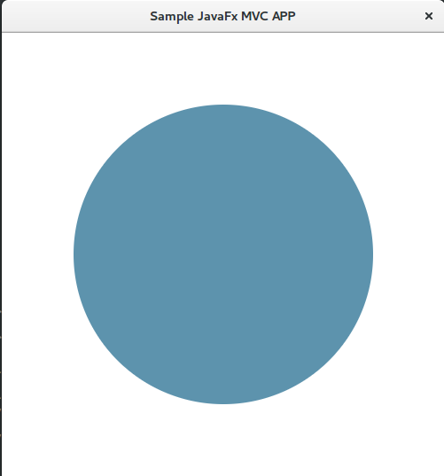

# JavaFx Sample/Starter App Model View Control (MVC)
Is an simple app which renders a circle. 
The circle radius can be manipulated by the mouse cursor position and the color changes by clicking on the circle.

## Build and run with Gradle Wrapper

In this project Gradle is used as an build automation system. So we can **launch the 
app** by running the following gradle command in the java-fx-mvc directory where the gradle wrapper `gradlew` is located: 

`./gradlew run`

